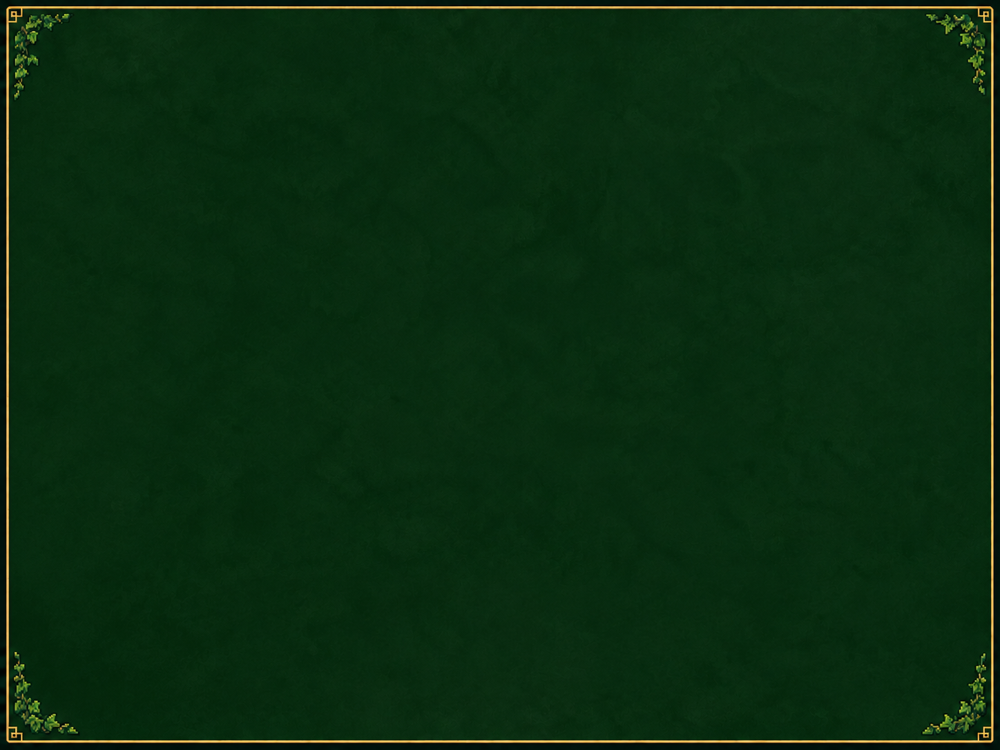

# Z3-Launcher

**A graphical Zelda 3 installer, updater and configuration manager for Linux and Windows.**

[](https://github.com/legluondunet/Z3-Launcher/actions/workflows/build.yml)
[](LICENSE)

Z3-Launcher is a Rust desktop application for [legluondunet/zelda3](https://github.com/legluondunet/zelda3), based on the [snesrev/zelda3](https://github.com/snesrev/zelda3) project. It downloads prebuilt game releases, extracts the required assets from **your own ROM**, and provides a graphical interface for configuring and launching the game.

**No compiler, Git checkout, system Python or command-line setup is needed to play.**



*The forest artwork used by the launcher. A full application screenshot will be added here.*

## Features

- **Install and play:** select a compatible US ROM, download the latest game release, extract assets locally, and launch Zelda 3.
- **Safe game updates:** verify downloads with SHA-256 checksums, regenerate game resources, and preserve existing configuration, save files, MSU music packs and imported languages. Failed file replacements are rolled back.
- **Graphical settings:** adjust gameplay, graphics, audio, keyboard bindings, gamepad controls and shortcuts without manually editing the INI file.
- **Built-in INI editor:** edit `zelda3.ini` directly. Changes are saved when leaving the tab, with validation and status feedback.
- **Automatic settings saves:** valid changes are saved automatically and applied on the next game launch.
- **Input configuration:** assign keyboard shortcuts and SDL gamepad bindings, capture inputs, and restore default controller bindings.
- **Graphics customization:** choose display and fullscreen modes, rendering options, Link sprites and compatible OpenGL `.glsl` / `.glslp` shaders.
- **Multilingual interface:** English, French, German, Spanish and Italian. Importing a supported game-language ROM is a separate feature and does not change the interface language.
- **Portable installations:** keep game files and preferences alongside the launcher when portable mode is enabled.
- **Forest-inspired interface:** pixel-art background, translucent panels, and gold-accented controls.

## Supported platforms

| Platform | Distribution |
| --- | --- |
| Windows x86_64 | Standalone `z3-launcher.exe` |
| Linux x86_64 | Native binary |
| Linux x86_64 | AppImage |

Build artifacts are available from [GitHub Actions](https://github.com/legluondunet/Z3-Launcher/actions). Published versions are listed under [Releases](https://github.com/legluondunet/Z3-Launcher/releases).

## Quick start

1. Download Z3-Launcher for your operating system.
2. Start the launcher and select your **headerless US Zelda: A Link to the Past ROM** (`.sfc` or `.smc`).
3. Select **Download and install**. The launcher retrieves the game package and generates `zelda3_assets.dat` locally.
4. Select **Play Zelda 3**.
5. Customize the game in the **Game**, **Graphics**, **Audio**, **Controls**, **Shortcuts**, or **zelda3.ini** tabs.

### ROM requirements

The supported US ROM has SHA-256:

```text
66871d66be19ad2c34c927d6b14cd8eb6fc3181965b6e517cb361f7316009cfb
```

The ROM is processed **on your computer** and is never uploaded. This repository and its releases do not contain Nintendo ROMs or copyrighted game assets.

The game release includes a standalone resource extractor with its own Python runtime and dependencies. The launcher generates `zelda3_assets.dat` in the installed game's directory and retains the ROM there for subsequent resource regeneration.

## Updating the game

Use **Update game** to download the latest compatible [zelda3 release](https://github.com/legluondunet/zelda3/releases/latest) and regenerate its assets. The updater checks the published `SHA256SUMS` file, preserves user data and protects the existing installation when an update fails.

Public downloads do not require a GitHub account or API token. A game release must be available before installation can proceed.

## Command-line interface

The graphical launcher also supports:

```bash
z3-launcher setup --rom /path/to/zelda3.sfc
z3-launcher update
z3-launcher run
z3-launcher status
```

Use `--dir DIRECTORY` to choose a different workspace. See [WINDOWS.md](WINDOWS.md) and [APPIMAGE.md](APPIMAGE.md) for platform-specific information.

## Translations

The interface includes English, French, German, Spanish and Italian. External translation catalogs can extend or override the built-in messages without recompiling the launcher. See [TRANSLATING.md](TRANSLATING.md) to contribute translations.

## Building from source (developers)

Z3-Launcher itself is written in Rust. To build it, install Rust and the relevant platform development libraries (SDL2, X11/Wayland and OpenGL on Linux).

```bash
cargo test
cargo build --release
```

For non-GUI tests, run `cargo test --no-default-features`. To build the Linux AppImage, run `bash ./build-appimage.sh`.

**These dependencies are only required to develop or build Z3-Launcher. They are not required to install or play Zelda 3 through a distributed launcher.**

## License and credits

Z3-Launcher is distributed under **GPL-3.0-or-later**. See [LICENSE](LICENSE) and [LICENSING.md](LICENSING.md) for license details and preserved upstream notices.

Game project: [legluondunet/zelda3](https://github.com/legluondunet/zelda3) · Original Zelda 3 reverse-engineering project: [snesrev/zelda3](https://github.com/snesrev/zelda3).
